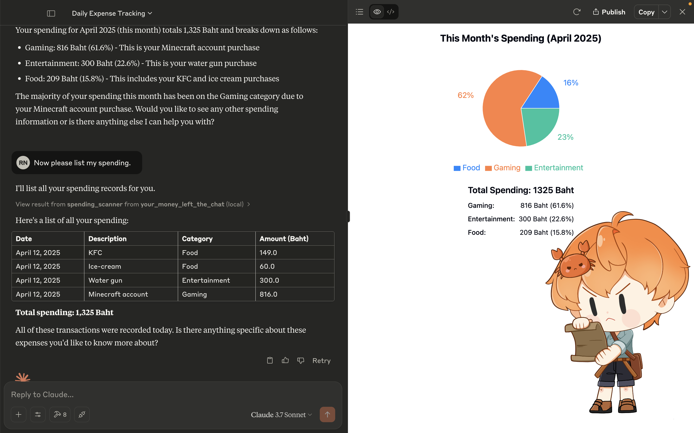

# Your Money Left The Chat

## 📀 Demo Video

[](https://youtu.be/1X9WQuZ4N5w)

## TL;DR

A Rust-native 🦀, SQLite-backed, LLM-powered financial tracking system

AI-powered money tracker that logs your spending, analyzes your habits, and calculates taxes. all through natural conversation.

Talk to Claude or Ollama, and the system will store everything locally using SQLite, no cloud bullshit.

## 🧠 Features

- ✍️ **Natural Language Input**
  Log expenses like:

  > “Spent 129 baht on KFC today” → Stored instantly

- 📆 **Smart Summaries**
  Daily, monthly, yearly breakdowns, including category-based analytics

- 📊 **Graph View (Only Claude Can Do THIS!!!)**
  Visualize how much of your soul goes into food every month

- 📉 **Tax Calculation**
  Estimate how much you’ll owe Uncle Sam (or whoever)

- 🔒 **Offline & Local-First**
  100% yours – no internet, no accounts, no surveillance capitalism

## 🦀 Tech Stack

| Layer        | Tech                            |
| ------------ | ------------------------------- |
| Backend      | MCP Rust SDK + SQLite + Diesel  |
| AI Interface | Claude / Ollama (via `mcp-cli`) |

## 🔧 Getting Started

1. **Install Rust, SQLite, and Makefile**

   Rust: https://www.rust-lang.org/tools/install
   SQLite: https://sqlite.org/download.html
   GNU Make: https://www.gnu.org/software/make/

2. **Clone the Repo**

   ```bash
   https://github.com/Rayato159/your-money-left-the-chat
   cd your-money-left-the-chat
   ```

3. **Install Diesel CLI**

   ```bash
    cargo install diesel_cli --no-default-features --features sqlite
   ```

   > If you facing with the error that can't find `sqlite3.lib`, Please install `sqlite3` on your machine first.

4. **Create Sqlite Database**

   Just create file `database.db` in any folder you want, or you can use this command

5. **Database Setup**

   Makefile:

   ```bash
   make migrate-up
   ```

   Or using cargo as original

   ```bash
   diesel migrate run
   ```

6. **Build the Project**

   Makefile:

   ```bash
    make build-release
   ```

   Or using cargo as original

   ```bash
   cargo build --release --bin your_money_left_the_chat
   ```

7. **Edit the config file**

   Find the `config.json`, of your MCP agent then add this

   Windows:

   ```json
   {
     "mcpServers": {
       "money": {
         "command": "PATH-TO/your-money-left-the-chat/target/release/your_money_left_the_chat.exe",
         "args": ["PATH-TO/database.db"]
       }
     }
   }
   ```

   Linux/MacOS:

   ```json
   {
     "mcpServers": {
       "money": {
         "command": "PATH-TO/your-money-left-the-chat/target/release/your_money_left_the_chat",
         "args": ["PATH-TO/database.db"]
       }
     }
   }
   ```

8. **Chatting with your dude (MCP Agent):**

   ```text
    You: "Hey, I spent 129 baht on KFC today"
    MCP Agent: "Got it! I've logged that expense for you. Anything else?"
   ```
